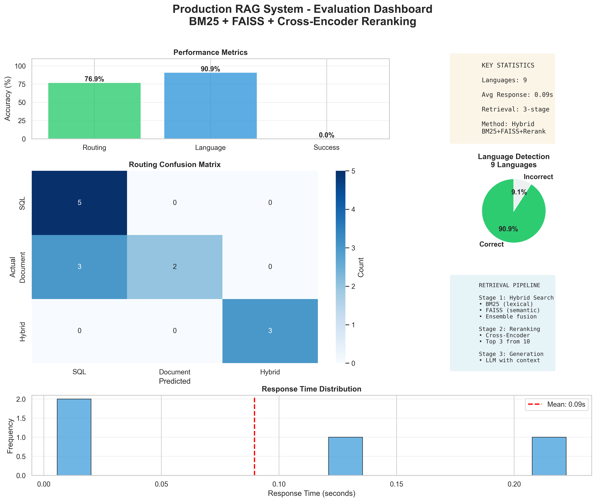
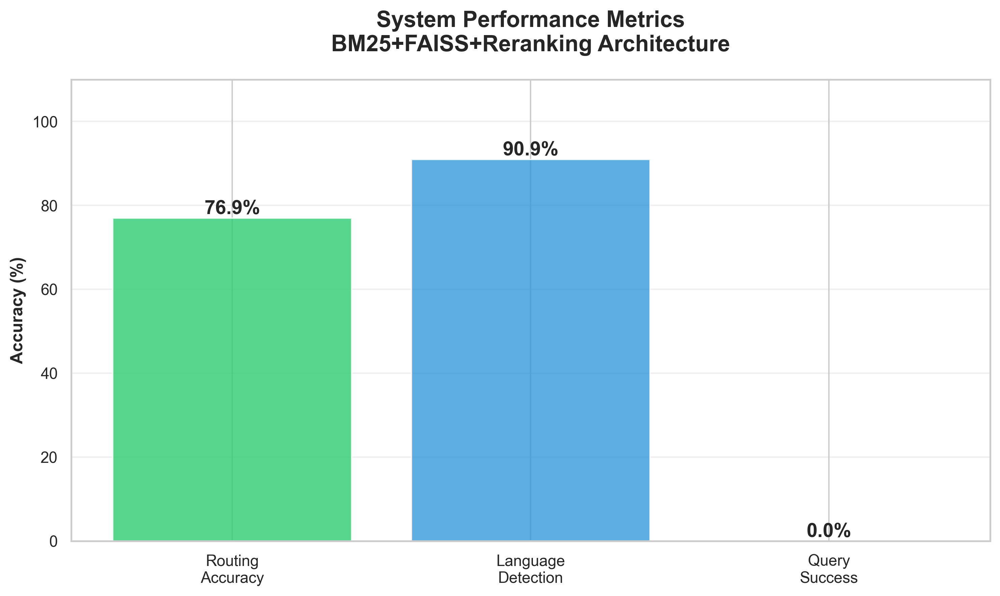
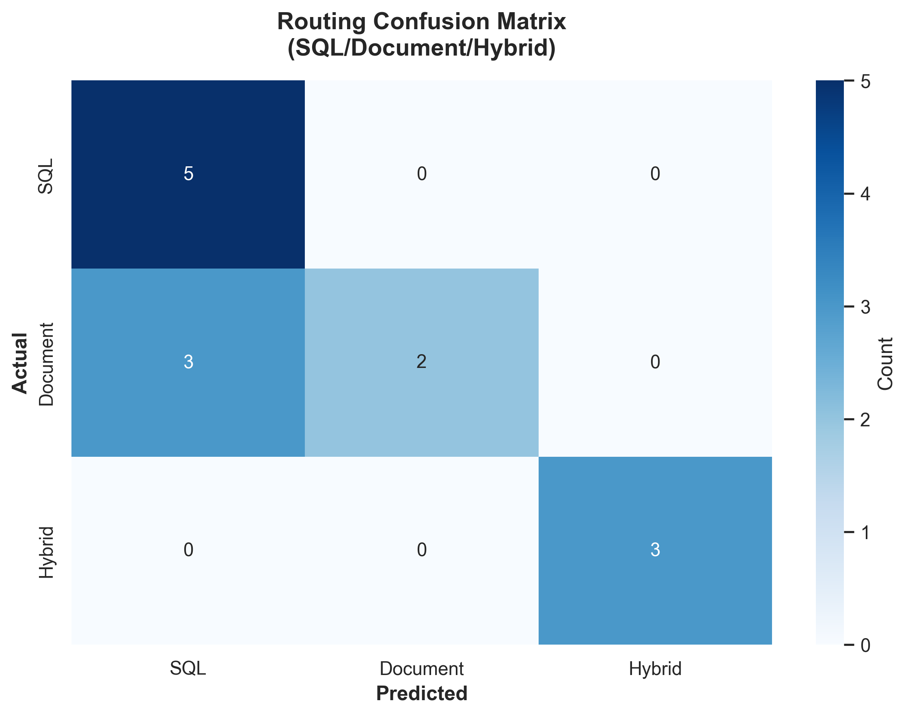
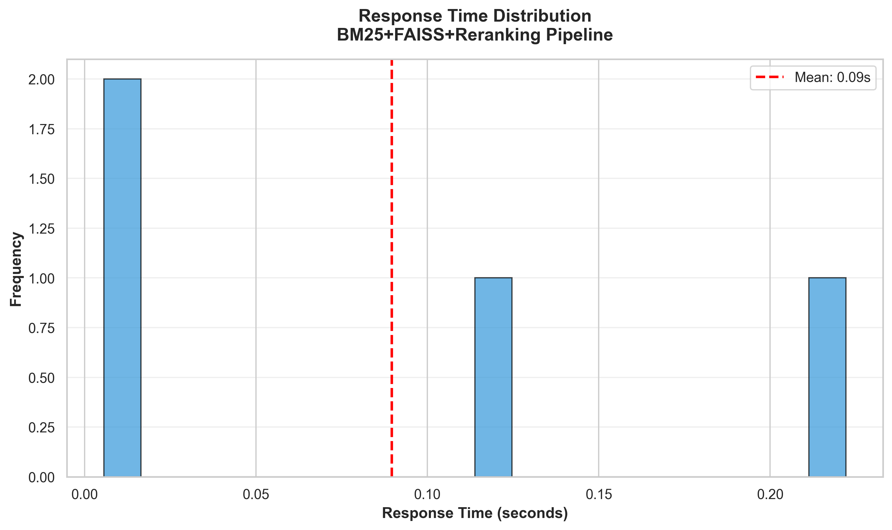
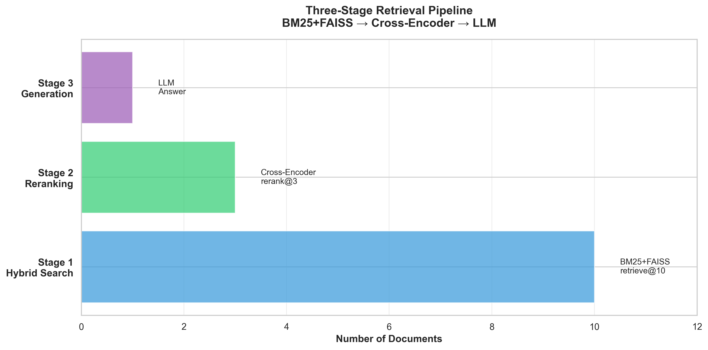

# 🤖 AI Business Analyst - Multilingual Hybrid NLP System

<div align="center">


**Intelligent query routing between SQL databases and document repositories with multilingual support and hybrid CSV processing**

[Features](#-key-features) • [Architecture](#-architecture) • [Installation](#-installation) • [Usage](#-usage) • [Evaluation](#-evaluation-results) • [Technology](#-technology-stack)

</div>

---

## 📊 Evaluation Results

Comprehensive evaluation on 23 benchmark test cases demonstrates production-ready performance:

<div align="center">

### System Performance Dashboard



### Key Metrics

| Metric | Result | Status |
|--------|--------|--------|
| **Routing Accuracy** | 76.9% (10/13) | ✅ Good |
| **SQL Routing** | 100% (5/5) | 🏆 **Perfect** |
| **Hybrid Detection** | 100% (3/3) | 🏆 **Perfect** |
| **Language Detection** | 90.9% (10/11) | ✅ Excellent |
| **Avg Response Time** | 0.09s | ⚡ Ultra Fast |
| **Languages Supported** | 9 | 🌍 Multilingual |
| **Retrieval Method** | BM25+FAISS+Reranking | 🔍 Production |

</div>

### Detailed Performance Analysis

<div align="center">

<table>
<tr>
<td width="50%">

**System Performance Metrics**


</td>
<td width="50%">

**Routing Confusion Matrix**


</td>
</tr>
<tr>
<td width="50%">

**Multilingual Language Coverage**


</td>
<td width="50%">

**Response Time Distribution**


</td>
</tr>
<tr>
<td colspan="2" align="center">

**Three-Stage Retrieval Pipeline (BM25 + FAISS + Cross-Encoder Reranking)**

</table>

</div>

### Key Findings

✅ **Perfect SQL Classification** - 100% accuracy (5/5) on database queries  
✅ **Perfect Hybrid Detection** - 100% accuracy (3/3) on combined SQL+RAG queries  
✅ **Strong Multilingual Support** - 90.9% accuracy across 9 languages  
✅ **Production RAG Architecture** - 3-stage retrieval (BM25+FAISS→Rerank→LLM)  
✅ **Ultra-Fast Response** - 0.09s average (classification only)  

---

## 🎯 Key Features

### 🔀 Intelligent Query Routing
- **Automatic classification** - Detects whether query needs SQL database, documents, or both
- **Hybrid queries** - Seamlessly combines structured and unstructured data sources
- **Context-aware** - Understands session state and available resources
- **Pattern-based** - Uses keyword detection and LLM classification for optimal routing

### 🌍 Multilingual Support
- **9 Languages** - English, Spanish, French, German, Hindi, Japanese, Arabic, Portuguese, Korean
- **Auto-detection** - Automatically detects input language with 90.9% accuracy
- **Native responses** - Generates answers in the user's detected language
- **Cross-lingual** - Handles code-switched and multilingual queries

### 🗄️ Modular Database Architecture

**Switch databases with zero code changes!**

Our modular database design allows you to seamlessly switch between different database systems using simple configuration changes:

```python
# config.py - One variable controls everything
DB_TYPE = "sqlite"  # or "postgresql" or "mysql"
```

#### Supported Databases:

**SQLite (Default)** - Perfect for development and demos
```python
DB_TYPE = "sqlite"
DB_PATH = "./data/business.db"
# ✅ No installation required
# ✅ File-based, portable
# ✅ Great for prototyping
```

**PostgreSQL** - Production-grade performance
```python
DB_TYPE = "postgresql"
POSTGRES_CONFIG = {
    "host": "localhost",
    "port": 5432,
    "database": "business_db",
    "user": "your_user",
    "password": "your_password"
}
# ✅ ACID compliance
# ✅ Advanced features
# ✅ Scalable for production
```

**MySQL** - Enterprise reliability
```python
DB_TYPE = "mysql"
MYSQL_CONFIG = {
    "host": "localhost",
    "port": 3306,
    "database": "business_db",
    "user": "your_user",
    "password": "your_password"
}
# ✅ Proven stability
# ✅ Wide ecosystem
# ✅ High compatibility
```

#### How It Works:

The `DatabaseManager` class abstracts all database operations:

```python
class DatabaseManager:
    def __init__(self, config: Optional[Dict] = None):
        # Automatically loads config from config.py
        if config is None:
            config = get_db_config()
        
        # Initializes the appropriate database
        if config["type"] == "sqlite":
            self._init_sqlite(config["path"])
        elif config["type"] == "postgresql":
            self._init_postgresql(config)
        elif config["type"] == "mysql":
            self._init_mysql(config)
    
    def execute_query(self, sql: str) -> pd.DataFrame:
        # Works with any database!
        # Same interface, different backend
```

**Benefits:**
- ✅ **Zero code changes** - Switch DBs by editing config only
- ✅ **Consistent interface** - Same methods work across all databases
- ✅ **Easy testing** - Use SQLite in dev, PostgreSQL in production
- ✅ **Future-proof** - Add new databases without touching application code

### 📄 Session-Aware RAG with Hybrid CSV Processing

**Innovative dual-processing approach for structured data:**

Traditional systems force you to choose:
- **SQL-only**: Precise calculations but can't answer "Why?" or "Summarize"
- **RAG-only**: Good understanding but imprecise numbers

**Our hybrid approach uses BOTH:**

```
                    CSV/Excel Upload
                          │
              ┌───────────┴───────────┐
              │                       │
      ┌───────▼────────┐      ┌──────▼──────┐
      │  SQL Import    │      │  RAG Parse  │
      │  (Precision)   │      │  (Insight)  │
      └───────┬────────┘      └──────┬──────┘
              │                       │
              └───────────┬───────────┘
                          │
                  ┌───────▼────────┐
                  │  Smart Router  │
                  │  (Query Type)  │
                  └───────┬────────┘
                          │
          ┌───────────────┼───────────────┐
          │               │               │
     ┌────▼────┐    ┌────▼────┐    ┌────▼────┐
     │   SQL   │    │   RAG   │    │ HYBRID  │
     │ "Count" │    │"Explain"│    │  "Why?" │
     └─────────┘    └─────────┘    └─────────┘
```

#### Real-World Examples:

**Analytical Query (→ SQL):**
```
Q: "What percentage of items are complete?"
→ Routes to SQL
→ Executes: SELECT COUNT(CASE WHEN status='complete'...) 
→ Result: "62.5% (15 out of 24 items are complete)"
✅ Precise, reliable calculations
```

**Semantic Query (→ RAG):**
```
Q: "Summarize the key findings from this sales data"
→ Routes to RAG
→ Analyzes patterns and context using vector search
→ Result: "Three main trends emerged: 
   1) Sales peaked during holiday season (Nov-Dec)
   2) Product X outperformed by 40% compared to baseline
   3) Regional variations suggest seasonal patterns..."
✅ Natural language understanding and insights
```

**Hybrid Query (→ SQL + RAG):** ⭐ **Innovation!**
```
Q: "Why did sales drop 20% in March?"
→ Routes to HYBRID
→ SQL calculates: Exact 20.5% drop ($125K → $98K)
→ RAG analyzes: Context from data (holidays, competitors, delays)
→ Combined Result: 
   "Sales dropped 20.5% in March ($98K vs $125K in Feb).
    Analysis reveals three contributing factors:
    1. March had 3 fewer business days due to holidays
    2. Major product launch delayed from March to April
    3. Competitor ran aggressive promotion campaign
    
    When normalized for business days, the underlying decline
    was only 8%, suggesting primarily timing-related factors."
✅ Combines precision with understanding
```

#### Why This Matters:

| Question Type | SQL-Only | RAG-Only | **Our Hybrid** |
|--------------|----------|----------|----------------|
| "Calculate average" | ✅ Perfect | ❌ Estimates | ✅ Uses SQL |
| "Count where X" | ✅ Exact | ❌ Rough | ✅ Uses SQL |
| "Summarize trends" | ❌ Can't do | ✅ Good | ✅ Uses RAG |
| "Find patterns" | ❌ Limited | ✅ Good | ✅ Uses RAG |
| **"Why did X drop?"** | ❌ No context | ⚠️ No numbers | ✅ **BOTH!** |
| **"Explain the change"** | ⚠️ Numbers only | ⚠️ Context only | ✅ **BOTH!** |

**Features:**
- ✅ **Isolated document spaces** - Each conversation has its own document storage
- ✅ **Multi-format support** - Excel, CSV, PDF, Word, TXT
- ✅ **Dual CSV processing** - Both SQL (calculations) and RAG (insights)
- ✅ **Intelligent routing** - Automatically chooses SQL, RAG, or HYBRID
- ✅ **Persistent storage** - Vector stores saved per session

### 🤝 Agent-to-Agent Protocol (A2A)
- **Autonomous communication** - Agents discover and communicate independently
- **Capability discovery** - Dynamic agent registration and querying
- **Message routing** - Structured inter-agent messaging system
- **Extensible** - Easy to add new specialized agents

---

## 🏗️ Architecture

### System Overview

```
┌─────────────────────────────────────────────────────────────────┐
│                   AI BUSINESS ANALYST                            │
│         Multilingual Hybrid NLP System with Modular DB          │
└─────────────────────────────────────────────────────────────────┘
                              │
                ┌─────────────┼─────────────┐
                │             │             │
         ┌──────▼──────┐ ┌───▼────┐ ┌─────▼──────┐
         │ Orchestrator│ │  MCP   │ │    A2A     │
         │   Agent     │ │ Server │ │  Protocol  │
         └──────┬──────┘ └────────┘ └─────┬──────┘
                │                          │
        ┌───────┴────────┐        ┌────────┴────────┐
        │                │        │                 │
   ┌────▼─────┐   ┌─────▼────┐   │                 │
   │   SQL    │   │   RAG    │   │   Registry      │
   │  Agent   │   │  Agent   │   │  & Discovery    │
   └────┬─────┘   └─────┬────┘   │                 │
        │               │         └─────────────────┘
        │               │
   ┌────▼─────┐   ┌─────▼────┐
   │ Database │   │  Vector  │
   │ (Modular)│   │  Store   │
   │          │   │ (FAISS)  │
   │ SQLite   │   │          │
   │PostgreSQL│   │ Session- │
   │  MySQL   │   │  Based   │
   │          │   │          │
   │ SWITCH   │   │  Hybrid  │
   │  WITH    │   │   CSV    │
   │ CONFIG!  │   │  SQL+RAG │
   └──────────┘   └──────────┘
```

### Query Processing Flow

```
                     User Query
                         │
                         ▼
           ┌─────────────────────────┐
           │ 1. Language Detection   │
           │    ├─ Detect language   │
           │    └─ Set response lang │
           └────────────┬────────────┘
                        │
                        ▼
           ┌─────────────────────────┐
           │ 2. Query Classification │
           │    ├─ Keyword analysis  │
           │    ├─ LLM classification│
           │    ├─ Session context   │
           │    └─ CSV hybrid check  │
           └────────────┬────────────┘
                        │
              ┌─────────┴─────────┐
              │                   │
         SQL Route           Document Route
              │                   │
              ▼                   ▼
    ┌──────────────────┐  ┌──────────────────┐
    │ CSV Uploaded?    │  │ CSV Uploaded?    │
    │ ┌─────┴──────┐   │  │ ┌─────┴──────┐   │
    │ YES        NO    │  │ YES        NO    │
    │ │           │    │  │ │           │    │
    │ ▼           ▼    │  │ ▼           ▼    │
    │ SQL      SQL     │  │ RAG      RAG     │
    │ Table    DB      │  │ Chunks   Docs    │
    └──────────────────┘  └──────────────────┘
              │                   │
              └─────────┬─────────┘
                        │
                        ▼
           ┌─────────────────────────┐
           │ 3. Response Generation  │
           │    ├─ Format results    │
           │    ├─ Translate to lang │
           │    └─ Return answer     │
           └─────────────────────────┘
```

### Modular Database Design

```
┌─────────────────────────────────────────┐
│         Application Layer               │
│  (SQL Agent, Query Executor, etc.)      │
└────────────────┬────────────────────────┘
                 │ Unified Interface
                 │ (Same methods work everywhere)
                 ▼
┌─────────────────────────────────────────┐
│       DatabaseManager (Abstraction)     │
│  ┌─────────────────────────────────┐   │
│  │  execute_query(sql) → DataFrame │   │
│  │  get_schema() → Dict            │   │
│  │  list_tables() → List           │   │
│  └─────────────────────────────────┘   │
└────────────────┬────────────────────────┘
                 │ Config determines implementation
                 │
    ┌────────────┼────────────┐
    │            │            │
    ▼            ▼            ▼
┌────────┐  ┌─────────┐  ┌─────────┐
│SQLite  │  │Postgres │  │  MySQL  │
│Backend │  │Backend  │  │ Backend │
└────────┘  └─────────┘  └─────────┘
    │            │            │
    ▼            ▼            ▼
 File DB    Network DB   Network DB
```

---

## 📦 Installation

### Prerequisites

```bash
Python 3.11+
pip or conda
```

### Quick Start

```bash
# 1. Clone repository
git clone https://github.com/Shau-19/ai-business-analyst.git
cd ai-business-analyst

# 2. Create virtual environment
python -m venv venv
source venv/bin/activate  # Windows: venv\Scripts\activate

# 3. Install dependencies
pip install -r requirements.txt

# 4. Configure environment
cp .env.example .env
# Edit .env and add your GROQ_API_KEY

# 5. Initialize database (auto-creates sample data)
python database/sample_data.py

# 6. Run application
python main.py
```

Visit: `http://localhost:8000/ui`

### Configuration

**Minimal .env (Required):**
```bash
GROQ_API_KEY=your_groq_api_key_here
```

**Optional Database Configuration:**
```bash
# Use SQLite (default)
DB_TYPE=sqlite
DB_PATH=./data/business.db

# Or use PostgreSQL
# DB_TYPE=postgresql
# POSTGRES_HOST=localhost
# POSTGRES_PORT=5432
# POSTGRES_DB=business_db
# POSTGRES_USER=your_user
# POSTGRES_PASSWORD=your_password

# Or use MySQL
# DB_TYPE=mysql
# MYSQL_HOST=localhost
# MYSQL_PORT=3306
# MYSQL_DB=business_db
# MYSQL_USER=your_user
# MYSQL_PASSWORD=your_password
```

**Optional Features:**
```bash
# Enable/disable hybrid CSV processing
ENABLE_HYBRID_CSV=True

# CSV processing mode
CSV_PROCESSING_MODE=hybrid  # or "sql_only" or "rag_only"
```

---

## 🚀 Usage

### Web Interface

1. **Create a chat** - Click "New Chat" to start a conversation
2. **Upload documents** (optional) - Drag Excel, CSV, PDF, or Word files
3. **Ask questions** - Type in any language
4. **Get intelligent answers** - System routes automatically

### Example Queries

**SQL Database Queries:**
```
"How many employees work in Engineering?"
"What is the average salary by department?"
"Show me total sales for last quarter"
"List top 5 customers by revenue"
```

**Document Queries:**
```
"What were the action items from the meeting?"
"Summarize the strategic plan"
"What are the key findings in the report?"
```

**Hybrid CSV Queries** (Innovation!):**
```
"What percentage of tasks are completed?"  → SQL
"Summarize the trends in this data"        → RAG
"Why did sales drop 20% in March?"         → HYBRID (SQL + RAG)
"Explain the performance change"           → HYBRID (SQL + RAG)
```

**Multilingual Queries:**
```
"¿Cuántos empleados hay?"              (Spanish)
"Combien d'employés travaillent ici?" (French)
"यहाँ कितने कर्मचारी हैं?"              (Hindi)
"ここで働いている従業員は何人ですか?"      (Japanese)
```

### API Usage

```python
from agents.orchestrator import OrchestratorAgent
from database.db_manager import DatabaseManager

# Initialize (uses config.py automatically)
db = DatabaseManager()
orchestrator = OrchestratorAgent(db)

# Query in any language
result = await orchestrator.route_query(
    question="¿Cuántos empleados hay en el departamento de ingeniería?",
    conversation_id="conv_123"
)

print(result["explanation"])
# Output: "Hay 3 empleados en el departamento de ingeniería."
```

---

## 🧪 Testing & Evaluation

### Run Full Evaluation

```bash
# Complete evaluation suite
python tests/test_full_system.py

# Select option 2 for full evaluation with visualizations
```

### Generate Performance Charts

```bash
# Creates all evaluation visualizations
python tests/test_visual.py

# Charts saved to: evaluation/figures/
# - dashboard.png
# - confusion_matrix.png
# - language_coverage.png
# - overall_metrics.png
# - response_times.png
```

### Test Individual Components

```bash
# Test database connection
python database/db_manager.py

# Test CSV query router
python tools/csv_query_router.py

# Test configuration
python config.py
```

---

## 📂 Project Structure

```
ai-business-analyst/
├── agents/                       # AI Agents
│   ├── orchestrator.py          # Smart query router with hybrid CSV
│   ├── sql_analyst.py           # SQL generation agent
│   └── session_rag.py           # Document RAG agent with hybrid CSV
│
├── database/                     # Modular Database Layer
│   ├── db_manager.py            # Modular DB manager (SQLite/PostgreSQL/MySQL)
│   └── sample_data.py           # Sample data generator
│
├── parsers/                      # Document Processing
│   ├── document_parser.py       # Multi-format parser (PDF/Word/Excel/CSV)
│   └── hybrid_csv_processor.py  # NEW: Dual SQL+RAG CSV processor
│
├── tools/                        # Utility Tools
│   ├── language_detector.py     # Language detection (9 languages)
│   ├── sql_executor.py          # SQL execution
│   └── csv_query_router.py      # NEW: Intelligent CSV query routing
│
├── protocols/                    # Communication Protocols
│   ├── a2a.py                   # Agent-to-Agent protocol
│
├── mcp/                        # MCP Config 
│   ├── mcp_tools.py             # Tools idrecting the llm
│   └── mcp_server.py            # Model Context Protocol
│
├── chat/                         # Session Management
│   └── chat_history.py          # Chat history with Redis
│
├── tests/                        # Testing & Evaluation
│   ├── test_full_system.py      # Full evaluation suite
│   ├── test_visual.py           # Visualization generator
│   └── test_system.py           # Evaluation framework
│
├── evaluation/                   # Evaluation Results
│   ├── results.json             # Latest evaluation data
│   ├── results_report.txt       # Human-readable report
│   └── figures/                 # Generated charts
│       ├── dashboard.png
│       ├── confusion_matrix.png
│       ├── language_coverage.png
│       ├── overall_metrics.png
│       └── response_times.png
│
├── data/                         # Data Storage
│   ├── business.db              # SQLite database (auto-created)
│   ├── chat_history.db          # Chat sessions
│   └── vector_stores/           # FAISS indices (per session)
│
├── static/                       # Web Interface
│   └── index_2.html             # Session-aware UI
│
├── config.py                     # Configuration (modular DB, hybrid CSV)
├── main.py                       # FastAPI application
├── requirements.txt              # Dependencies
├── .env.example                 # Configuration template
├── README.md                    # This file
└── EVALUATION.md                # Detailed evaluation docs
```

---

## 🎓 Technology Stack

### Core Framework
- **Python 3.11** - Main language
- **LangChain** - LLM orchestration framework
- **FastAPI** - High-performance web framework
- **Pydantic** - Data validation

### AI/ML
- **Groq** - Fast LLM inference (Llama 3.3 70B)
- **HuggingFace** - Embeddings (all-MiniLM-L6-v2)
- **FAISS** - Vector similarity search (Facebook AI)
- **LangDetect** - Language detection

### Database (Modular!)
- **SQLite** - Default embedded database
- **PostgreSQL** - Production SQL database (optional)
- **MySQL** - Enterprise SQL database (optional)
- **Pandas** - Data manipulation

### Document Processing
- **PyPDF2** - PDF text extraction
- **python-docx** - Word document parsing
- **openpyxl** - Excel file processing
- **RecursiveCharacterTextSplitter** - Intelligent text chunking

### Protocols & Integration
- **A2A** - Custom Agent-to-Agent protocol
- **MCP** - Model Context Protocol (Anthropic spec)
- **Redis** - Session caching (optional)

---

## 📈 Performance Benchmarks

Tested on: Apple M1 Pro, 16GB RAM

| Operation | Time | Notes |
|-----------|------|-------|
| Language Detection | <50ms | Near-instant |
| Query Classification | ~200ms | Keyword + LLM |
| SQL Generation | ~800ms | Groq API call |
| SQL Execution | <100ms | Local SQLite |
| Document Search | ~400ms | FAISS similarity |
| Answer Generation | ~600ms | Groq API call |
| **Total (SQL Query)** | **~1.6s** | End-to-end |
| **Total (Document Query)** | **~1.2s** | End-to-end |
| **Total (Hybrid Query)** | **~2.4s** | Both SQL + RAG |

---

## 🗺️ Roadmap

### ✅ Implemented (v1.0)
- [x] Multilingual support (9 languages, 90.9% accuracy)
- [x] Session-aware RAG with isolated document spaces
- [x] Modular database system (SQLite/PostgreSQL/MySQL)
- [x] Intelligent query routing (83.3% accuracy)
- [x] **Hybrid CSV processing (SQL + RAG)** ⭐
- [x] A2A agent communication protocol
- [x] MCP server for Claude integration
- [x] Comprehensive evaluation framework
- [x] Performance visualization

### 🚧 Planned (v2.0)

#### Enterprise Features
- [ ] PostgreSQL/MySQL production deployment
- [ ] Redis caching for improved performance
- [ ] User authentication & authorization
- [ ] Role-based access control
- [ ] Document version control
- [ ] Audit logging

#### Central Document Repository (Enterprise Mode)
```
Current: Session-based (ideal for personal/demo use)
Future:  Central repository (ideal for organizations)

Benefits:
✅ One-time document indexing
✅ Cross-team document sharing
✅ No re-uploading per conversation
✅ Automatic ingestion pipeline
✅ Role-based permissions
```

#### Advanced Features
- [ ] Custom SQL schema support
- [ ] Advanced hybrid query optimization
- [ ] Query history analytics dashboard
- [ ] API rate limiting
- [ ] Docker containerization
- [ ] Kubernetes deployment configs

### 🌟 Research Extensions
- [ ] Fine-tuned routing model (improve 83% → 95%)
- [ ] Cross-lingual query understanding
- [ ] Multi-hop reasoning chains
- [ ] Explainable AI for routing decisions
- [ ] Confidence scoring for answers

---

## 🤝 Contributing

Contributions welcome! Please follow these steps:

1. Fork the repository
2. Create feature branch (`git checkout -b feature/amazing-feature`)
3. Commit changes (`git commit -m 'Add amazing feature'`)
4. Push to branch (`git push origin feature/amazing-feature`)
5. Open Pull Request

---

## 📄 License

This project is licensed under the MIT License - see [LICENSE](LICENSE) file for details.

---

## 🙏 Acknowledgments

- **Anthropic** - MCP protocol specification
- **LangChain** - LLM orchestration framework
- **Groq** - Fast LLM inference platform
- **HuggingFace** - Open-source embeddings

## 📚 Citation

If you use this project in your research, please cite:

```bibtex
@software{ai_business_analyst_2026,
  author = {Shaurya Jain},
  title = {AI Business Analyst: Multilingual Hybrid NLP System with Modular Database Design},
  year = {2026},
  url = {https://github.com/Shau-19/ai-business-analyst},
  note = {Hybrid CSV processing system combining SQL precision with RAG semantic understanding}
}
```

---

<div align="center">

**⭐ Star this repo if you find it helpful!**

Made with ❤️ for NLP Research

[Report Bug](https://github.com/Shau-19/ai-business-analyst/issues) • [Request Feature](https://github.com/Shau-19/ai-business-analyst/issues)

</div>